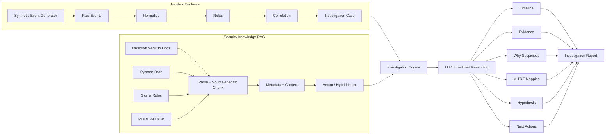
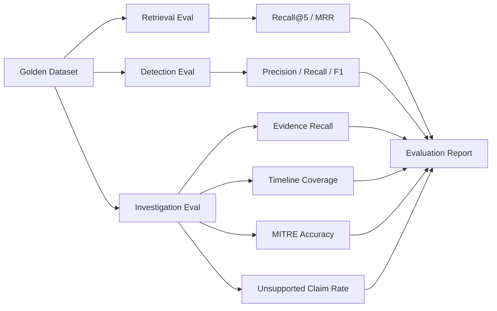

# Investigation Agent — Project Plan for Codex

> Mục tiêu: xây một **AI Security Investigation Agent** đủ gọn để hoàn thành nhanh, nhưng đủ rõ kiến trúc, evaluation và demo để đưa vào CV.
>
> Project **không dùng log nội bộ công ty**. Incident data được tạo từ **synthetic events có ground truth**; có thể bổ sung dataset public nếu muốn benchmark thêm.
>
> Trọng tâm sản phẩm:
>
> 1. Nhận một tập event/log của một incident.
> 2. Chuẩn hóa + correlation để tìm các hành vi đáng chú ý.
> 3. RAG lấy kiến thức từ Microsoft Security Docs, Sysmon Docs, Sigma Rules và MITRE ATT&CK.
> 4. LLM dựng timeline, chọn evidence, giải thích vì sao đáng nghi, map MITRE, đưa hypothesis và next investigation actions.
> 5. Có giao diện để analyst xem case, timeline, evidence, retrieved knowledge và investigation report.
> 6. Có golden dataset + evaluation để chứng minh hệ thống hoạt động, không chỉ demo UI.

---

# 0. Nguyên tắc triển khai cho Codex

Codex phải tuân theo các nguyên tắc này:

1. Đọc toàn bộ `PLAN.md` trước khi code.
2. Làm theo từng checkpoint, không implement toàn bộ cùng lúc.
3. Sau mỗi checkpoint:
   - chạy tests;
   - sửa cho tests pass;
   - cập nhật README;
   - ghi ngắn gọn những gì đã hoàn thành.
4. Không hard-code API key hoặc secret.
5. Tất cả config nằm trong `.env` hoặc `config/*.yaml`.
6. Synthetic data phải dùng random seed để reproducible.
7. Mọi kết luận của LLM phải trace được về `event_id` hoặc `knowledge_chunk_id`.
8. Không để LLM tự bịa MITRE technique nếu retrieval không có evidence.
9. Rule/correlation làm candidate detection; LLM làm investigation reasoning.
10. Không over-engineer:
    - MVP trước;
    - feature nâng cao để sau.
11. Mỗi module phải có type hints và docstring ngắn.
12. Ưu tiên code dễ đọc hơn code “thông minh”.

---

# 1. Product Scope

## 1.1. Bài toán

Một SOC analyst nhận rất nhiều event từ Windows/Sysmon/network logs.

Agent hỗ trợ:

```text
Raw events
    ↓
Normalize
    ↓
Rules + Correlation
    ↓
Investigation Case
    ↓
Retrieve Security Knowledge
    ↓
LLM Investigation Reasoning
    ↓
Timeline
Evidence
Why suspicious
MITRE mapping
Hypothesis
Next investigation actions
Investigation report
```

Agent **không thay analyst**, mà giúp analyst giảm thời gian đọc log và tra cứu tài liệu.

---

## 1.2. Hai loại dữ liệu phải tách riêng

### A. Incident Evidence

Đây là event/log của vụ việc đang điều tra.

Ví dụ:

- Windows Security Event
- Sysmon Event
- Network event
- Authentication event

Nguồn MVP:

- **synthetic events tự tạo**
- optional: public security datasets để kiểm thử bổ sung

Không đưa Incident Evidence vào knowledge RAG như tài liệu.

---

### B. Security Knowledge

Đây là tài liệu dùng để giải thích event.

Nguồn chính:

1. Microsoft Windows Security Auditing documentation
2. Microsoft Sysmon documentation
3. Sigma detection rules
4. MITRE ATT&CK Enterprise data

Các nguồn này đi vào Knowledge RAG.

---

# 2. Tech Stack

## Backend

- Python 3.11+
- FastAPI
- Pydantic
- SQLAlchemy

## Storage

- PostgreSQL: incidents, events, investigation outputs, evaluation results
- Qdrant: security knowledge vectors
- Local filesystem: raw downloaded files

## RAG

- Embedding provider configurable
- Qdrant dense search
- BM25 local index hoặc Qdrant sparse nếu tiện
- Hybrid retrieval + RRF
- Cross-encoder reranking ở checkpoint nâng cao

## LLM

Provider abstracted qua interface.

Ví dụ:

```python
class LLMClient:
    def generate_structured(...): ...
```

Không để business logic phụ thuộc trực tiếp một provider.

## UI

- Streamlit

Lý do: nhanh, đủ đẹp để demo CV, dễ làm timeline/table/filter.

## Infra

- Docker Compose:
  - app/backend
  - postgres
  - qdrant
  - streamlit

---

# 3. Repository Structure

```text
investigation-agent/
│
├── PLAN.md
├── README.md
├── .env.example
├── docker-compose.yml
├── pyproject.toml
│
├── config/
│   ├── sources.yaml
│   ├── rag.yaml
│   ├── correlation_rules.yaml
│   └── evaluation.yaml
│
├── data/
│   ├── raw/
│   │   ├── microsoft/
│   │   ├── sigma/
│   │   ├── mitre/
│   │   └── public_logs/
│   │
│   ├── processed/
│   │   ├── knowledge/
│   │   └── incidents/
│   │
│   ├── synthetic/
│   └── golden/
│
├── src/
│   ├── ingestion/
│   │   ├── download_microsoft.py
│   │   ├── load_sigma.py
│   │   ├── load_mitre.py
│   │   ├── parsers.py
│   │   ├── chunkers.py
│   │   ├── enrich.py
│   │   └── indexer.py
│   │
│   ├── events/
│   │   ├── schemas.py
│   │   ├── normalizer.py
│   │   ├── synthetic_generator.py
│   │   └── scenario_templates.py
│   │
│   ├── detection/
│   │   ├── rule_engine.py
│   │   ├── correlation.py
│   │   └── scoring.py
│   │
│   ├── rag/
│   │   ├── bm25.py
│   │   ├── dense.py
│   │   ├── hybrid.py
│   │   ├── reranker.py
│   │   └── retriever.py
│   │
│   ├── investigation/
│   │   ├── case_builder.py
│   │   ├── evidence_selector.py
│   │   ├── prompts.py
│   │   ├── schemas.py
│   │   ├── engine.py
│   │   └── report.py
│   │
│   ├── evaluation/
│   │   ├── retrieval_eval.py
│   │   ├── detection_eval.py
│   │   ├── investigation_eval.py
│   │   └── run_eval.py
│   │
│   ├── api/
│   │   ├── main.py
│   │   └── routes/
│   │
│   └── common/
│       ├── config.py
│       ├── logging.py
│       └── utils.py
│
├── ui/
│   └── app.py
│
├── scripts/
│   ├── ingest_knowledge.py
│   ├── generate_synthetic_data.py
│   ├── run_pipeline.py
│   └── run_evaluation.py
│
├── tests/
│   ├── test_ingestion.py
│   ├── test_normalizer.py
│   ├── test_correlation.py
│   ├── test_retrieval.py
│   └── test_investigation.py
│
└── notebooks/
    └── failure_analysis.ipynb
```

---

# 4. Security Knowledge Sources

## 4.1. Microsoft Windows Security documentation

MVP không cần crawl toàn bộ Microsoft Learn.

Chỉ cần curated list khoảng 10–20 event pages liên quan đến scenario demo.

Ví dụ:

- Event ID 4624 — successful logon
- Event ID 4625 — failed logon
- Event ID 4688 — process creation
- các event khác thật sự dùng trong synthetic scenarios

### Cách lấy

Tạo:

```yaml
# config/sources.yaml
microsoft_pages:
  - url: "..."
    type: "windows_event"
    event_id: 4624

  - url: "..."
    type: "windows_event"
    event_id: 4625
```

Downloader:

```text
URL
 ↓
HTTP fetch
 ↓
store raw HTML
 ↓
parse main article
 ↓
Markdown/text
```

Không crawl recursive cả website.

### Raw metadata

```json
{
  "source": "microsoft",
  "source_type": "windows_event_doc",
  "url": "...",
  "event_id": 4625,
  "downloaded_at": "...",
  "content_hash": "..."
}
```

---

# 4.2. Microsoft Sysmon documentation

Lấy trang Sysmon official và các phần mô tả event.

Không cần crawl cả Microsoft Learn.

Các event MVP nên tập trung:

- Process Create
- Network Connection
- File Create
- DNS Query nếu dùng trong scenario
- Process Access nếu cần scenario credential access

Parse theo event section.

---

# 4.3. Sigma Rules

Không crawl HTML.

Cách dễ và ổn định hơn:

```text
SigmaHQ repository / release
        ↓
download / clone
        ↓
select YAML rules
        ↓
parse YAML
```

MVP chỉ lấy subset liên quan:

```text
Windows
PowerShell
Process Creation
Authentication
Persistence
Credential Access
Network
```

Không cần ingest hàng nghìn rules.

### Logical unit

**1 Sigma rule = 1 knowledge document**

Không dùng recursive character splitter phá rule.

Normalize:

```json
{
  "source": "sigma",
  "rule_id": "...",
  "title": "...",
  "description": "...",
  "logsource": "...",
  "detection": "...",
  "falsepositives": [],
  "level": "...",
  "tags": [],
  "raw_rule": "..."
}
```

---

# 4.4. MITRE ATT&CK

Không crawl HTML nếu không cần.

Ưu tiên dùng ATT&CK STIX JSON.

```text
ATT&CK STIX
   ↓
parse Enterprise ATT&CK
   ↓
Technique / Sub-technique
   ↓
normalize
```

MVP chỉ index:

- technique
- sub-technique
- description
- detection-related context nếu có
- external_id
- tactic
- relationships cần thiết

Metadata:

```json
{
  "source": "mitre_attack",
  "technique_id": "T1059",
  "subtechnique_id": "T1059.001",
  "name": "PowerShell",
  "tactics": ["execution"],
  "version": "...",
  "modified": "..."
}
```

---

# 5. Offline Knowledge Ingestion Pipeline

```text
Download / Load
      ↓
Parse
      ↓
Normalize
      ↓
Chunk theo loại tài liệu
      ↓
Metadata enrichment
      ↓
Optional contextual enrichment
      ↓
Embedding
      ↓
Index Qdrant
```

---

# 6. Chunking Strategy

Không dùng cùng một splitter cho mọi nguồn.

## 6.1. Microsoft docs

Dùng:

```text
Structure-aware
+
Hierarchical
```

Ví dụ:

```text
Parent:
Event 4625

Children:
- Description
- Event Fields
- Logon Types
- Security Monitoring Recommendations
```

Retrieve bằng child nhỏ.

Khi generate có thể lấy thêm parent context.

---

## 6.2. Sysmon docs

Cắt theo:

```text
Event Type
    ↓
Description
    ↓
Relevant fields
    ↓
Security meaning
```

Không cắt giữa bảng/section nếu tránh được.

---

## 6.3. Sigma

```text
1 rule = 1 chunk
```

Nếu rule quá dài:

```text
Parent = full rule

Child:
- description
- detection
- false positive
```

---

## 6.4. MITRE

Giữ hierarchy:

```text
Tactic
  ↓
Technique
  ↓
Sub-technique
```

Một technique/sub-technique là một logical chunk.

---

# 7. Metadata

Mọi knowledge chunk bắt buộc có:

```json
{
  "chunk_id": "...",
  "document_id": "...",
  "source": "...",
  "source_type": "...",
  "title": "...",
  "url": "...",
  "section": "...",
  "version": "...",
  "effective_or_modified_date": "...",
  "event_id": null,
  "technique_id": null,
  "sigma_rule_id": null,
  "content_hash": "..."
}
```

Mục tiêu:

- trace nguồn;
- filter;
- chống duplicate;
- versioning;
- citation.

---

# 8. Idempotent Ingestion

Không insert duplicate khi chạy ingest nhiều lần.

Logic:

```text
download source
    ↓
calculate content_hash
    ↓
same document_id + same hash?
    ├─ yes → skip
    └─ no  → update version + re-index
```

Unique logical key:

```text
source + document_id + version
```

---

# 9. Enrichment

MVP ưu tiên:

## Required

- metadata extraction
- contextual prepend đơn giản

Ví dụ:

```text
[Context]
Source: Microsoft Windows Security documentation.
Event ID: 4625.
Section: Security Monitoring Recommendations.

[Content]
...
```

## Optional later

- summary
- hypothetical Q&A

Không cần bật ngay.

---

# 10. Event Data Model

Tất cả incident events phải normalize về một schema chung.

```python
class SecurityEvent(BaseModel):
    event_id: str
    timestamp: datetime

    source_type: str
    source_event_id: str | None

    host: str | None
    user: str | None

    event_type: str

    process_name: str | None
    parent_process_name: str | None
    command_line: str | None
    process_id: str | None
    parent_process_id: str | None

    src_ip: str | None
    dst_ip: str | None
    dst_port: int | None
    dst_domain: str | None

    file_path: str | None
    file_hash: str | None

    raw: dict

    synthetic_scenario_id: str | None
    ground_truth_labels: list[str]
```

---

# 11. Synthetic Incident Generator

Đây là phần rất quan trọng của project.

Không generate random log vô nghĩa.

Phải generate **scenario có câu chuyện + ground truth**.

Mỗi scenario gồm:

```text
Background benign events
        +
Suspicious sequence
        +
Noise events
```

Mỗi event có timestamp hợp lý.

---

# 12. Scenario Format

```yaml
scenario_id: INC-001

name: Failed logons followed by successful login

description: >
  Multiple failed logons for the same user followed by a successful
  login from the same external IP.

entities:
  host: WS-01
  user: alice
  src_ip: 203.0.113.10

ground_truth:
  suspicious: true

  key_event_types:
    - failed_logon
    - successful_logon

  expected_evidence:
    - EVT-001
    - EVT-002
    - EVT-003
    - EVT-004

  expected_mitre:
    - ...

  expected_findings:
    - repeated failed authentication
    - subsequent successful authentication

  expected_next_actions:
    - inspect authentication history
    - verify source IP reputation
    - inspect activity after successful logon
```

---

# 13. Synthetic Scenarios for MVP

Tạo khoảng **12 scenario templates**.

Mỗi template generate 3 variants.

Tổng:

```text
12 scenarios × 3 variants
= 36 investigation cases
```

## Suspicious scenarios

### S01 — Repeated Failed Logons → Success

```text
4625
4625
4625
4625
4625
↓
4624
```

Correlation:

```text
same user
same source IP
within 5 min
```

---

### S02 — PowerShell → Network Connection

```text
Process Create: powershell.exe
        ↓
Network connection
        ↓
File created
```

---

### S03 — Office Process Spawns Script Interpreter

Ví dụ:

```text
WINWORD.EXE
   ↓
powershell.exe
```

Chỉ mô phỏng telemetry, không chứa payload khai thác thật.

---

### S04 — Encoded / Suspicious PowerShell Command

Synthetic command line chỉ cần marker an toàn.

Không dùng command thực sự tải hoặc thực thi malware.

---

### S05 — Suspicious External Login Followed by Process Execution

```text
external login
   ↓
new process
   ↓
network connection
```

---

### S06 — Rare Process Access Pattern

Dùng event metadata mô phỏng process access.

---

### S07 — Scheduled Task Persistence Pattern

Synthetic events mô tả scheduled task creation + later execution.

---

### S08 — Suspicious DNS / Domain Connection

```text
process
  ↓
DNS query
  ↓
network connection
```

Domain dùng reserved/example domain.

---

## Benign/control scenarios

### B01 — Normal User Login

### B02 — Admin PowerShell Maintenance

### B03 — Browser Network Activity

### B04 — Software Update Process

Mục tiêu:

Agent phải biết rằng **không phải PowerShell nào cũng malicious**.

---

# 14. Noise Generation

Mỗi incident phải có noise.

Ví dụ:

```text
20–100 benign events
+
3–10 relevant events
```

Nếu không có noise thì investigation quá dễ và evaluation không có ý nghĩa.

Noise generator:

- browser process
- explorer.exe
- Teams
- standard logon
- update service
- normal DNS
- normal file create

---

# 15. Rules and Correlation

Không đưa 100k events thẳng cho LLM.

Pipeline:

```text
Events
  ↓
Simple Rules
  ↓
Correlation
  ↓
Candidate Behaviors
  ↓
Investigation Case
```

---

# 16. Simple Detection Rules

MVP implement 8–12 rules.

Ví dụ:

```text
R001 MultipleFailedLogons
R002 FailedThenSuccess
R003 ScriptInterpreterSpawn
R004 OfficeToScriptInterpreter
R005 ProcessToExternalNetwork
R006 SuspiciousCommandLineMarker
R007 ScheduledTaskCreation
R008 RareProcessAccess
```

Rule output:

```json
{
  "rule_id": "R002",
  "title": "Failed logons followed by success",
  "severity": "medium",
  "matched_event_ids": [
    "EVT-001",
    "EVT-002",
    "EVT-003"
  ],
  "reason": "...",
  "recommended_knowledge_queries": [
    "Windows failed logon event 4625",
    "Windows successful logon event 4624"
  ]
}
```

---

# 17. Correlation Engine

Correlation key examples:

```text
user
host
source IP
process GUID
parent PID
destination
```

Window:

```text
1 min
5 min
15 min
```

MVP correlation examples:

## Failed → Success

```text
>= 5 failed login
same user
same source IP
within 5 min
followed by successful login
```

## Process → Network

```text
process created
same process / host
network connection within 2 min
```

## Parent → Child

```text
parent_process
   ↓
child_process
```

---

# 18. Investigation Case Builder

Case format:

```python
class InvestigationCase(BaseModel):
    case_id: str

    start_time: datetime
    end_time: datetime

    hosts: list[str]
    users: list[str]

    events: list[SecurityEvent]

    triggered_rules: list[RuleMatch]

    severity_score: float

    candidate_behaviors: list[str]
```

Một case phải có đủ evidence trước khi gọi LLM.

---

# 19. RAG Query Construction

Không hỏi RAG một câu chung kiểu:

```text
"Explain this incident"
```

Tạo nhiều focused queries từ evidence.

Ví dụ case có:

```text
4625 × 5
4624 × 1
powershell process
network connection
```

Query set:

```text
Windows Event ID 4625 failed logon security monitoring

Windows Event ID 4624 successful logon

Sigma suspicious PowerShell network connection

MITRE PowerShell technique
```

Sau đó merge retrieval results.

---

# 20. Online Retrieval

Baseline:

```text
Query
   ├─ BM25
   └─ Dense
        ↓
      RRF
        ↓
     Top 20
        ↓
    Reranker
        ↓
     Top 5
```

MVP phase 1 có thể chỉ:

```text
Dense top-k
```

Sau khi pipeline chạy:

```text
Dense
→ Hybrid + RRF
→ reranker
```

để có baseline và improvement rõ cho CV.

---

# 21. Metadata Filtering

Nếu query có Event ID:

```text
4625
```

ưu tiên:

```text
source_type = windows_event_doc
event_id = 4625
```

Nếu query là MITRE:

```text
source_type = mitre_attack
```

Nếu query là detection behavior:

```text
source_type in [sigma, mitre_attack]
```

---

# 22. Investigation LLM Input

LLM nhận **structured evidence**, không nhận raw dump khổng lồ.

Prompt context:

```text
CASE
- case_id
- time range
- host
- user

EVENT TIMELINE
[E1] ...
[E2] ...
[E3] ...

DETECTION RESULTS
[R1] ...
[R2] ...

SECURITY KNOWLEDGE
[K1] Microsoft ...
[K2] Sigma ...
[K3] MITRE ...
```

---

# 23. Structured LLM Output

Bắt buộc JSON/Pydantic.

```python
class InvestigationResult(BaseModel):
    case_id: str

    summary: str

    timeline: list["TimelineItem"]

    key_evidence: list["EvidenceItem"]

    suspicious_findings: list["Finding"]

    mitre_mappings: list["MitreMapping"]

    hypotheses: list["Hypothesis"]

    next_actions: list["NextAction"]

    confidence: float
```

---

# 24. Evidence Contract

Mọi finding phải có evidence.

```python
class Finding(BaseModel):
    finding: str
    why_suspicious: str

    event_ids: list[str]
    knowledge_chunk_ids: list[str]

    confidence: float
```

Reject hoặc flag nếu:

```text
event_ids = []
```

với một claim nói về incident.

---

# 25. MITRE Mapping Contract

```python
class MitreMapping(BaseModel):
    technique_id: str
    technique_name: str

    supporting_event_ids: list[str]
    supporting_knowledge_chunk_ids: list[str]

    rationale: str
    confidence: float
```

Không cho LLM tạo technique ID tùy ý.

Validation:

```text
technique_id phải tồn tại trong MITRE index
```

---

# 26. Hypothesis

Hypothesis là **giả thuyết**, không phải kết luận chắc chắn.

Ví dụ:

```json
{
  "hypothesis": "The account may have been compromised after repeated failed authentication attempts.",
  "supporting_event_ids": ["..."],
  "contradicting_event_ids": [],
  "confidence": 0.72
}
```

UI phải hiện rõ:

```text
Hypothesis
not confirmed fact
```

---

# 27. Next Investigation Actions

Action phải phục vụ analyst kiểm chứng tiếp.

Ví dụ:

- review authentication history
- inspect activity after login
- inspect process tree
- check destination/domain reputation
- verify whether PowerShell usage was expected
- compare behavior with peer hosts

Không để model đề xuất action phá hoại hệ thống.

---

# 28. Investigation Report

Report gồm:

```text
Case Summary

Severity

Timeline

Key Evidence

Suspicious Findings

MITRE Mapping

Hypotheses

Next Investigation Actions

Sources / Citations
```

Cho phép export Markdown.

Optional:

- PDF later

---

# 29. UI

Dùng Streamlit.

Không làm dashboard quá phức tạp.

## Page 1 — Case List

```text
Filters:
[Severity]
[Host]
[User]
[Status]

Table:
Case ID
Time
Host
User
Severity
Triggered Rules
Status
```

Click case → Investigation View.

---

# 30. Page 2 — Investigation View

Layout:

```text
------------------------------------------------
Case INC-001          Severity: HIGH
Host: WS-01           User: alice
------------------------------------------------

[Timeline]

10:01  Failed login
10:02  Failed login
10:03  Failed login
10:06  Successful login
10:08  PowerShell started

------------------------------------------------
Triggered Behaviors
------------------------------------------------

Repeated failed authentication
Successful login after failures
PowerShell execution

------------------------------------------------
Key Evidence
------------------------------------------------

E1
E2
E3

------------------------------------------------
Why Suspicious
------------------------------------------------

...

------------------------------------------------
MITRE Mapping
------------------------------------------------

Technique
Evidence
Reason

------------------------------------------------
Hypothesis
------------------------------------------------

...

------------------------------------------------
Next Investigation Actions
------------------------------------------------

...
```

---

# 31. Page 3 — Evidence Explorer

Table:

```text
timestamp
source
event_type
host
user
process
src_ip
dst_ip
rule_match
```

Filters:

- time
- host
- user
- event_type
- process
- IP

Cho phép analyst inspect raw normalized event.

---

# 32. Page 4 — Knowledge Search

Cho người dùng thử RAG riêng.

Input:

```text
Search security knowledge:
"Event 4625 nghĩa là gì?"
```

Output:

```text
Retrieved chunks

Source
Title
Score
Metadata
Chunk text
```

Page này rất hữu ích khi demo retrieval.

---

# 33. Page 5 — Evaluation Dashboard

Hiển thị:

```text
Retrieval Recall@5
MRR
Detection Precision
Detection Recall
Detection F1
MITRE Accuracy
Evidence Grounding
Timeline Coverage
```

Có bảng failed cases.

---

# 34. Golden Dataset Strategy

Không chỉ có một golden set.

Tách thành 4 bộ.

```text
A. Knowledge Retrieval Golden
B. Detection Golden
C. Investigation Golden
D. End-to-End Incident Golden
```

---

# 35. A — Knowledge Retrieval Golden

Khoảng:

```text
50 queries
```

Format:

```json
{
  "query_id": "Q001",
  "query": "What does Windows Event ID 4625 indicate?",
  "expected_document_ids": [
    "microsoft-event-4625"
  ],
  "expected_source_types": [
    "windows_event_doc"
  ]
}
```

Phân nhóm:

```text
15 Windows Event questions
10 Sysmon questions
15 MITRE questions
10 Sigma/detection questions
```

Metric:

```text
Recall@5
MRR
nDCG@5 optional
```

MVP target:

```text
Recall@5 >= 0.80
```

---

# 36. Retrieval Experiment

So sánh:

```text
A. Dense only
B. BM25 only
C. Hybrid + RRF
D. Hybrid + reranker
```

Lưu kết quả vào:

```text
artifacts/eval/retrieval_results.csv
```

README phải có bảng:

```text
| Retrieval | Recall@5 | MRR |
|-----------|----------|-----|
| Dense     | ...      | ... |
| Hybrid    | ...      | ... |
| +Rerank   | ...      | ... |
```

Đây là một phần rất tốt để viết CV.

---

# 37. B — Detection Golden

Ground truth có sẵn từ synthetic scenario generator.

Mỗi scenario biết:

```text
events nào suspicious
rule nào nên fire
behavior nào expected
```

Ví dụ:

```json
{
  "scenario_id": "INC-001",
  "expected_rule_ids": [
    "R001",
    "R002"
  ]
}
```

Metric:

```text
Precision
Recall
F1
False Positive Rate
```

Không dùng LLM để chấm phần này.

---

# 38. C — Investigation Golden

Mỗi golden case có:

```json
{
  "case_id": "INC-001",

  "required_evidence": [
    "EVT-001",
    "EVT-002"
  ],

  "expected_findings": [
    "multiple failed logons",
    "successful login after failures"
  ],

  "allowed_mitre_techniques": [
    "..."
  ],

  "forbidden_claims": [
    "malware confirmed"
  ],

  "required_next_action_categories": [
    "authentication_review",
    "post_login_activity_review"
  ]
}
```

---

# 39. Investigation Metrics

## 39.1. Evidence Recall

```text
required evidence found
-----------------------
total required evidence
```

---

## 39.2. Evidence Precision

```text
relevant selected evidence
--------------------------
all selected evidence
```

---

## 39.3. Timeline Coverage

```text
golden key events present in generated timeline
-----------------------------------------------
total golden key events
```

---

## 39.4. Timeline Order Accuracy

Check timestamp ordering deterministic bằng code.

Không cần LLM judge.

---

## 39.5. MITRE Mapping Accuracy

Exact match / precision / recall trên technique IDs.

---

## 39.6. Unsupported Claim Rate

Finding có claim nhưng:

```text
không có supporting event
hoặc
không có supporting knowledge
```

→ unsupported.

Target:

```text
< 5%
```

---

# 40. LLM-as-Judge

Chỉ dùng cho phần khó chấm bằng deterministic metric:

- quality của hypothesis
- usefulness của next action
- explanation clarity

Rubric 1–5:

```text
1 = poor
3 = acceptable
5 = strong
```

Không dùng một score duy nhất.

Lưu:

```text
groundedness
completeness
actionability
clarity
```

Pin judge model/version trong config.

---

# 41. RAGAS

RAGAS có thể dùng cho **knowledge RAG QA**:

```text
Context Recall
Context Precision
Faithfulness
Answer Relevancy
```

Không dùng RAGAS để thay toàn bộ investigation evaluation.

Investigation cần custom metrics ở trên.

---

# 42. Golden Dataset Size for CV Project

MVP hợp lý:

```text
Retrieval queries:
50

Synthetic incident cases:
36

Deep investigation golden cases:
12

Benign/control cases:
ít nhất 12 trong 36 cases
```

Không cần hàng nghìn sample.

Quan trọng hơn:

```text
có ground truth rõ
+
có nhiều failure mode
+
có baseline vs improved
```

---

# 43. Train / Dev / Test Split

Synthetic variants không được leak.

Ví dụ:

```text
template S01
 ├─ variant A → dev
 ├─ variant B → test
 └─ variant C → test
```

Không để exact duplicate vào cả dev/test.

Đơn giản hơn:

```text
60% dev
40% test
```

nhưng split theo `scenario_template`, hoặc ít nhất theo variant seed.

---

# 44. Failure Cases phải cố ý tạo

Golden set cần các case khó:

```text
same behavior nhưng benign
same process khác context
noise nhiều
2 users cùng host
events xen kẽ
out-of-order raw input
missing event
duplicate event
similar MITRE techniques
same Event ID khác context
```

Nếu chỉ test case đẹp, score không có ý nghĩa.

---

# 45. Observability

Structured JSON logs.

Mỗi request có:

```text
trace_id
case_id
retrieval_query
retrieved_chunk_ids
retrieval_scores
rule_matches
llm_model
prompt_tokens
completion_tokens
latency_ms
```

Không log secret.

Synthetic project không có PII thật nhưng vẫn thiết kế như production.

---

# 46. API Endpoints

MVP:

```text
GET  /health

POST /knowledge/ingest

POST /knowledge/search

POST /events/generate

GET  /cases

GET  /cases/{case_id}

POST /cases/{case_id}/investigate

GET  /cases/{case_id}/report

POST /evaluation/run
```

---

# 47. Database Tables

Minimal tables:

```text
knowledge_documents
events
cases
case_events
rule_matches
investigation_results
evaluation_runs
evaluation_metrics
```

Vector data lưu Qdrant.

---

# 48. Checkpoint 0 — Project Bootstrap

## Tasks

- create repository structure
- Python environment
- FastAPI hello endpoint
- Streamlit hello page
- PostgreSQL connection
- Qdrant connection
- Docker Compose
- `.env.example`
- logging config
- pytest

## Acceptance

```bash
docker compose up
```

chạy được:

```text
FastAPI
Streamlit
Postgres
Qdrant
```

Tests pass.

---

# 49. Checkpoint 1 — Knowledge Ingestion

## Tasks

Implement:

```text
Microsoft loader
Sysmon loader
Sigma loader
MITRE STIX loader
normalize documents
content hash
version metadata
```

Raw files được lưu dưới:

```text
data/raw/
```

Processed documents:

```text
data/processed/knowledge/
```

## Acceptance

Command:

```bash
python scripts/ingest_knowledge.py --prepare-only
```

phải tạo normalized JSONL.

---

# 50. Checkpoint 2 — Chunk + Index

## Tasks

Implement source-specific chunking:

```text
Microsoft → structure-aware + hierarchical
Sysmon → structure-aware
Sigma → rule-level
MITRE → technique/sub-technique
```

Add:

```text
metadata
contextual prepend
embedding
Qdrant indexing
```

## Acceptance

```bash
python scripts/ingest_knowledge.py
```

sau đó:

```bash
curl /knowledge/search?q=event+4625
```

trả đúng Microsoft chunk.

---

# 51. Checkpoint 3 — Synthetic Event Generator

## Tasks

Implement:

```text
SecurityEvent schema
scenario templates
noise generation
seeded generator
36 cases
```

Output:

```text
data/synthetic/incidents.jsonl
```

## Acceptance

Chạy hai lần cùng seed phải cho cùng output.

Mỗi scenario có ground truth.

---

# 52. Checkpoint 4 — Detection + Correlation

## Tasks

Implement 8–12 simple rules.

Correlation engine.

Case builder.

## Acceptance

S01 phải trigger:

```text
MultipleFailedLogons
FailedThenSuccess
```

Benign scenarios không được trigger sai quá nhiều.

Unit tests cho correlation window.

---

# 53. Checkpoint 5 — RAG Baseline

## Tasks

Implement:

```text
dense retrieval
metadata filtering
citations
```

Tạo 50-query retrieval golden set.

Run baseline.

Save metrics.

## Acceptance

Có:

```text
retrieval_baseline.json
```

và script reproducible.

---

# 54. Checkpoint 6 — Production Retrieval Improvement

Implement:

```text
BM25
Dense
RRF
Top-20
Cross-encoder rerank
Top-5
```

So sánh với baseline.

## Acceptance

README có bảng delta.

Không bắt buộc improvement phải luôn > baseline trên mọi metric, nhưng phải có failure analysis.

---

# 55. Checkpoint 7 — Investigation Engine

Implement:

```text
case
↓
focused RAG queries
↓
retrieve knowledge
↓
structured LLM
↓
validated result
```

Add:

```text
timeline
evidence
why suspicious
MITRE
hypothesis
next actions
```

Validation:

- unknown event id → reject reference
- unknown chunk id → reject reference
- unknown MITRE technique → reject mapping

---

# 56. Checkpoint 8 — Investigation Evaluation

Implement:

```text
Evidence Recall
Evidence Precision
Timeline Coverage
Timeline Order
MITRE Precision/Recall
Unsupported Claim Rate
```

Optional judge metrics.

Run on deep golden cases.

---

# 57. Checkpoint 9 — UI

Implement Streamlit pages:

```text
Cases
Investigation
Evidence Explorer
Knowledge Search
Evaluation
```

UI ưu tiên clarity.

Không mất thời gian animation.

---

# 58. Checkpoint 10 — End-to-End Demo

Script:

```bash
python scripts/generate_synthetic_data.py

python scripts/ingest_knowledge.py

python scripts/run_pipeline.py --case INC-001

streamlit run ui/app.py
```

Expected demo:

```text
1. Open case
2. See timeline
3. See triggered rule
4. See evidence
5. See retrieved Microsoft/Sigma/MITRE knowledge
6. Run Investigation
7. See hypothesis + next actions
8. Open report
9. Open evaluation metrics
```

---

# 59. Checkpoint 11 — README / CV Polish

README phải có:

## Problem

SOC analysts phải đọc nhiều log và tra cứu nhiều nguồn.

## Architecture

Mermaid diagram.

## Data

Synthetic incidents + public security knowledge.

## RAG

Source-specific ingestion + hybrid retrieval + rerank.

## Investigation

Rules/correlation → LLM reasoning.

## Evaluation

Bảng metrics.

## Demo

Screenshots hoặc GIF.

## Limitations

- synthetic logs
- limited security knowledge subset
- not a production SIEM
- LLM output still requires analyst review

---

# 60. Mermaid Architecture for README



---

# 61. Evaluation Architecture



---

# 62. Suggested Metrics Table for Final README

Điền bằng kết quả thật, không bịa.

```text
| Component | Metric | Baseline | Final |
|---|---:|---:|---:|
| Retrieval | Recall@5 | TBD | TBD |
| Retrieval | MRR | TBD | TBD |
| Detection | Precision | TBD | TBD |
| Detection | Recall | TBD | TBD |
| Detection | F1 | TBD | TBD |
| Investigation | Evidence Recall | TBD | TBD |
| Investigation | Timeline Coverage | TBD | TBD |
| Investigation | MITRE F1 | TBD | TBD |
| Investigation | Unsupported Claim Rate | TBD | TBD |
```

---

# 63. Minimum Viable Version

Nếu thời gian ít, phải hoàn thành đúng các phần này trước:

```text
1. 4 knowledge sources
2. source-specific parsing/chunking
3. Qdrant dense retrieval
4. 8 synthetic scenarios + benign controls
5. normalization
6. 5 core correlation rules
7. investigation structured output
8. timeline/evidence/MITRE/next action
9. Streamlit UI
10. golden retrieval set
11. detection + investigation metrics
12. README architecture + real results
```

---

# 64. Stretch Goals

Chỉ làm sau MVP:

- hybrid BM25 + dense + RRF
- cross-encoder reranking
- contextual embedding
- hypothetical Q&A enrichment
- Sigma rule execution bằng pySigma
- graph relation giữa user/host/process/IP
- LangGraph investigation workflow
- human approval button
- report PDF
- public OTRF dataset benchmark
- anomaly scoring / ML

Không làm ML trước khi MVP hoàn chỉnh.

---

# 65. What NOT To Do

Không:

```text
LLM đọc toàn bộ raw logs
```

Không:

```text
embed toàn bộ incident logs rồi gọi đó là investigation
```

Không:

```text
recursive chunk tất cả source giống nhau
```

Không:

```text
đưa toàn bộ Sigma repository vào ngay từ đầu
```

Không:

```text
dùng LLM để quyết định tất cả rule/detection
```

Không:

```text
chỉ demo 1 case không có evaluation
```

Không:

```text
ghi metric giả vào README/CV
```

---

# 66. Definition of Done

Project được coi là hoàn thành khi:

- [ ] Có script download/load public knowledge.
- [ ] Có version/hash để ingestion idempotent.
- [ ] Có source-specific chunking.
- [ ] Có vector search.
- [ ] Có synthetic incident generator.
- [ ] Có benign và suspicious cases.
- [ ] Có rules + correlation.
- [ ] Có structured Investigation Case.
- [ ] LLM dựng timeline.
- [ ] LLM chọn evidence có citation.
- [ ] Có `why_suspicious`.
- [ ] Có MITRE mapping.
- [ ] Có hypothesis.
- [ ] Có next investigation actions.
- [ ] Có report.
- [ ] Có Streamlit UI.
- [ ] Có retrieval golden set.
- [ ] Có detection golden set.
- [ ] Có investigation golden set.
- [ ] Có baseline vs final evaluation.
- [ ] Có failure analysis.
- [ ] README có architecture.
- [ ] README có screenshots.
- [ ] README có metrics thật.
- [ ] Toàn bộ project chạy được bằng README.

---

# 67. Suggested CV Description

Sau khi project có kết quả thật, viết CV theo dạng:

```text
Investigation Agent — AI-assisted SOC incident investigation

• Built an investigation pipeline that correlates synthetic Windows/Sysmon
  security events and uses RAG over Microsoft Security documentation,
  Sigma rules and MITRE ATT&CK to generate evidence-grounded incident reports.

• Implemented source-aware ingestion, metadata filtering, hybrid retrieval
  and structured LLM outputs for timeline reconstruction, suspicious behavior
  explanation, MITRE mapping, hypothesis generation and next-step recommendations.

• Designed reproducible synthetic incident scenarios and a multi-layer evaluation
  suite covering retrieval, detection, evidence grounding, timeline coverage
  and MITRE mapping.
```

Chỉ thêm metric khi đã chạy evaluation thật:

```text
• Improved Recall@5 from X to Y...
```

---

# 68. Final Priority Order

Codex phải làm theo thứ tự:

```text
P0
Architecture + schemas + synthetic data

P1
Knowledge ingestion + retrieval

P2
Rules + correlation

P3
Investigation LLM

P4
Golden dataset + evaluation

P5
UI

P6
Hybrid/rerank improvements

P7
README + demo polish
```

Nếu một checkpoint chưa pass tests thì không chuyển checkpoint tiếp theo.

---

# 69. Public Source Notes

Các nguồn nên ưu tiên:

- MITRE ATT&CK STIX data: machine-readable ATT&CK data.
- SigmaHQ: detection rules ở dạng YAML.
- Microsoft Learn: Windows Security Auditing / Sysmon documentation.
- OTRF Security Datasets: chỉ dùng như **optional external benchmark**, không thay synthetic ground-truth dataset chính.

Project chính vẫn phải chạy hoàn toàn được khi không tải external log dataset.

---

# 70. Final Product Story

Demo cuối cùng phải kể được câu chuyện sau:

```text
Một analyst nhận case có nhiều events
        ↓
Hệ thống correlation phát hiện chuỗi đáng chú ý
        ↓
Analyst mở case
        ↓
Timeline cho thấy chuyện gì xảy ra
        ↓
Evidence cho thấy event nào quan trọng
        ↓
RAG lấy Microsoft / Sigma / MITRE knowledge
        ↓
Agent giải thích tại sao hành vi đáng nghi
        ↓
Agent map MITRE
        ↓
Agent đưa hypothesis, nhưng không khẳng định quá mức
        ↓
Agent đề xuất bước điều tra tiếp theo
        ↓
Analyst có thể trace mọi claim về event/source gốc
```

Đây là giá trị chính của project.


