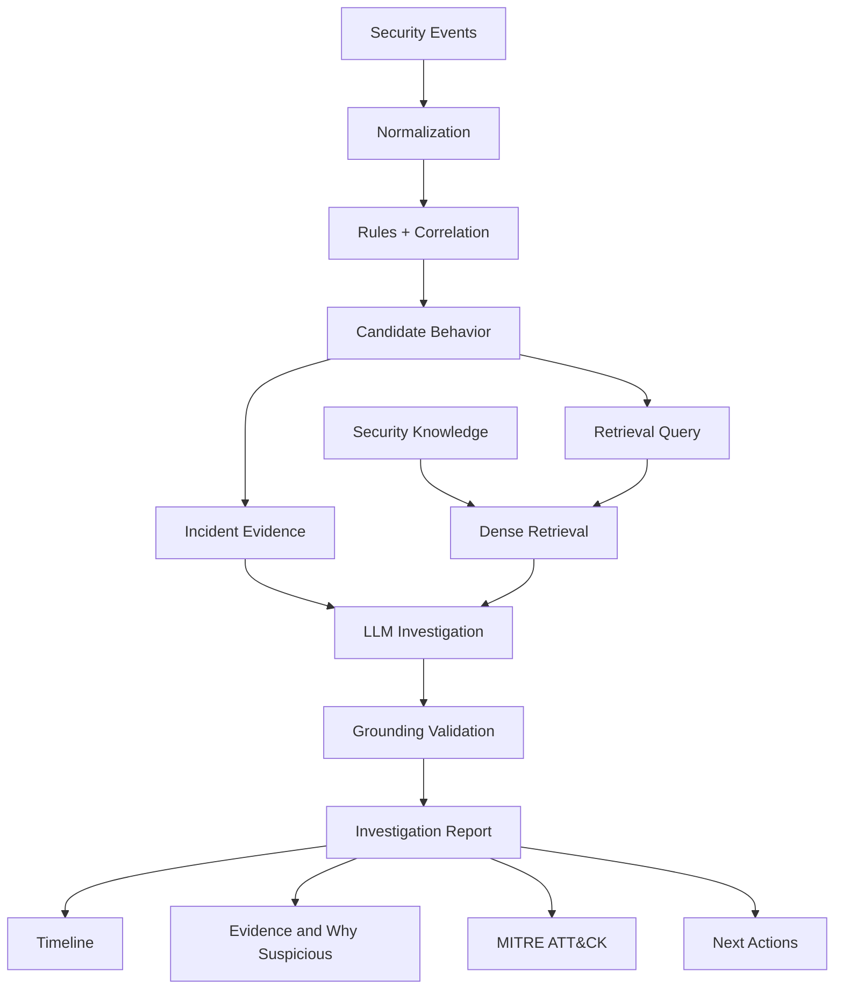
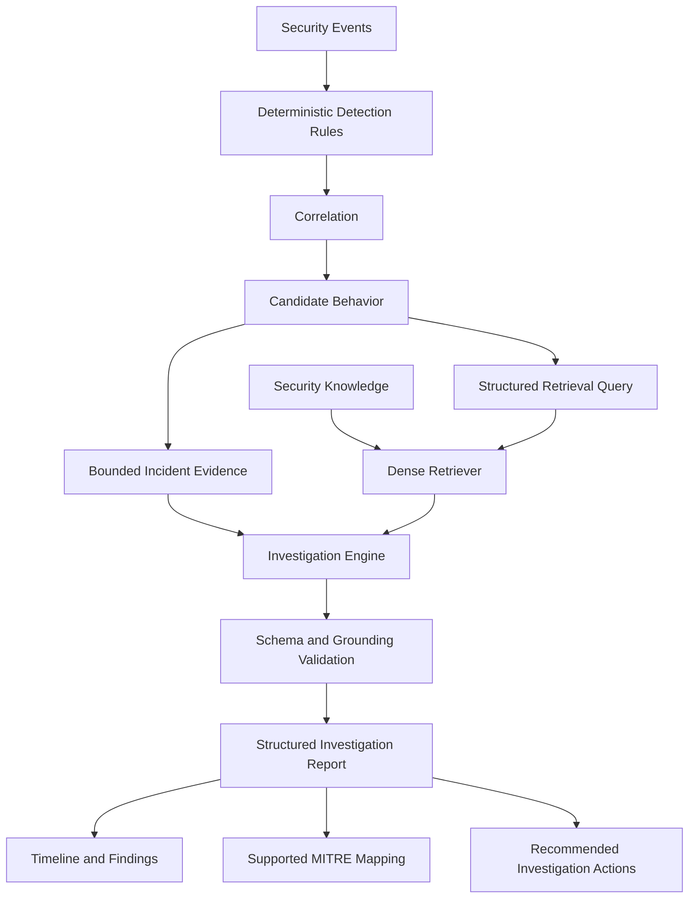

# Investigation Agent

An evidence-grounded SOC investigation prototype combining deterministic security detection,
security-knowledge retrieval, and structured LLM reasoning to produce traceable incident
investigation reports.

> The LLM does not perform primary detection directly from raw logs. Deterministic rules and
> correlation first identify candidate behaviors. The LLM investigates only bounded evidence.

The reported results are prototype measurements on synthetic incident telemetry and a manually
curated retrieval benchmark; they are not claims of real-world SOC detection accuracy or
production readiness.



## Verified prototype results

- Detection benchmark: 24/24 suspicious synthetic cases detected, 0/12 benign controls
  escalated, and 57/57 expected rule matches covered across 36 cases.
- Dense retrieval benchmark: Recall@5 0.9400 and MRR 0.7867 over 50 locked golden queries.
- Grounded investigation: 3/3 representative cases passed deterministic evidence-grounding
  validation using the live `gemini-3.7-flash` provider with Qdrant-backed retrieval.
- Quality gates: 69 tests pass and Ruff passes; the suite contains no paid or network LLM calls.

The reproducible live result is saved at
[`artifacts/eval/investigation_demo_gemini.json`](artifacts/eval/investigation_demo_gemini.json).

The authoritative implementation plan is [INVESTIGATION_AGENT_PLAN.md](INVESTIGATION_AGENT_PLAN.md).
See [docs/DEMO.md](docs/DEMO.md) for a two-minute walkthrough and [PROGRESS.md](PROGRESS.md) for
verified checkpoint details. Existing learning material in `docs/` is preserved as supporting
context.

## Current status

Checkpoints 0 through 5 and the grounded investigation vertical slice are complete. See
[PROGRESS.md](PROGRESS.md) for verified status.
The deterministic detection baseline is reported separately from later RAG/LLM evaluation.

## Architecture boundary

Incident evidence is normalized and correlated deterministically. Public Microsoft, Sysmon,
Sigma, and MITRE ATT&CK material is ingested into a separate knowledge corpus. Only a bounded
case, rule matches, and cited knowledge are supplied to the investigation model.

The Python layout uses one installable package at `src/investigation_agent/`. Its subpackages
match the functional boundaries in the PLAN while avoiding ambiguous top-level imports.

## Local setup

```bash
python -m venv .venv
# Windows PowerShell: .venv\Scripts\Activate.ps1
python -m pip install -e ".[dev]"
Copy-Item .env.example .env
pytest
uvicorn investigation_agent.api.main:app --reload
```

Run the UI separately:

```bash
streamlit run ui/app.py
```

## Docker

```bash
docker compose up --build
python scripts/smoke_test.py
```

Services:

- API and OpenAPI: `http://localhost:18000/docs`
- Streamlit: `http://localhost:8501`
- PostgreSQL: `localhost:5432`
- Qdrant: `http://localhost:6333/dashboard`

Use `.env` to override local defaults. The bundled local Qdrant service has no authentication, so
leave `QDRANT_API_KEY` empty; set it only for Qdrant Cloud or another secured deployment. Do not
commit credentials.

## Generate the synthetic incident dataset

Checkpoint 3 defines 8 suspicious scenarios (`S01`-`S08`) and 4 benign controls
(`B01`-`B04`) in `config/synthetic_scenarios.yaml`. Each template has static, human-authored
ground truth; generation does not call an LLM. The default command creates three deterministic
variants per template:

```bash
python scripts/generate_synthetic_data.py --seed 42 --variants 3
```

The checked-in benchmark at `data/synthetic/incidents.jsonl` contains 36 cases and 1,943 events.
Every case contains 20-80 interleaved benign noise events and 3-10 story-relevant events. Stable
IDs use the form `INC-S02-V01-E0001`; timestamps are timezone-aware and stored in canonical
causal order. `metadata.input_event_ids` and `metadata.missing_event_ids` separately model
out-of-order or missing ingestion without corrupting that canonical timeline. Variant 3 also
covers duplicate telemetry, multiple users on one host, and simultaneous processes.

Use `--output` to change the JSONL destination. `summary.json` is written beside it unless
`--summary-output` is provided. Re-running with identical inputs is byte-for-byte idempotent.

## Run deterministic detection and correlation

Checkpoint 4 runs normalized events through ten configuration-owned rules, reusable correlation
primitives, candidate-behavior aggregation, and the investigation case builder. It does not call
an LLM and runtime case construction does not read synthetic ground truth.

```bash
python scripts/run_detection.py
```

Defaults:

- Input: `data/synthetic/incidents.jsonl`
- Rule configuration: `config/correlation_rules.yaml`
- Cases: `data/processed/incidents/cases.jsonl`
- Expected-versus-actual report: `data/processed/incidents/detection_summary.json`

The current seed-42 baseline processes all 36 cases into 57 rule matches and 27 candidate
behaviors. It detects 24/24 suspicious cases, misses 0/24, escalates 0/12 benign controls, and
hits all 57 configured rule expectations. B02 intentionally matches only the low-severity R003
PowerShell signal (score 2) and is not escalated. An identical second run does not rewrite either
output artifact.

Severity weights and the escalation threshold are configurable. The default weights are 1/2/4/7
for informational/low/medium/high, with case escalation at score 7. Ground truth is used only by
the separate comparison step; pass `--include-ground-truth` only when an exported case needs
evaluation context.

## Prepare and index the security knowledge corpus

The curated list in `config/sources.yaml` covers Microsoft Windows Security event pages, the
official Sysmon reference, a small scenario-relevant Sigma subset, and a pinned Enterprise
ATT&CK STIX release. Remote bytes and provenance sidecars are cached under `data/raw/`; normalized
logical documents and deterministic chunks are written under `data/processed/knowledge/`.
Raw/processed knowledge artifacts and local embedding models are intentionally gitignored and
can be reproduced from the source config. The synthetic Checkpoint 3 benchmark is checked in.

Run the full pipeline (download/cache, normalize, source-aware chunk, embed, and Qdrant sync):

```bash
python scripts/ingest_knowledge.py
```

The default embedding provider is the local, CPU-friendly FastEmbed model
`BAAI/bge-small-en-v1.5`; it requires no paid API key. The first run downloads the model to
`data/models/fastembed/`. Provider, model, and batch size can be overridden with the
`EMBEDDING_PROVIDER`, `EMBEDDING_MODEL`, and `EMBEDDING_BATCH_SIZE` environment variables.

To stop after Checkpoint 1 normalization:

```bash
python scripts/ingest_knowledge.py --prepare-only
```

After the source and model caches exist, the full pipeline can be reproduced without fetching
the curated sources again:

```bash
python scripts/ingest_knowledge.py --offline
```

Use `--refresh` to re-fetch every curated source. Unchanged source bytes retain their original
download timestamp and content hash; normalized document/chunk JSONL files are only replaced when
their bytes change. Qdrant uses deterministic point IDs, replaces each current document's points,
and removes documents no longer present in the corpus.

Chunking boundaries are source-aware:

- Microsoft Windows event pages: one stored parent plus retrievable logical-section children.
- Sysmon: one stored parent plus retrievable chunks grouped by Event ID/logical section.
- Sigma: exactly one retrievable chunk per complete rule.
- MITRE ATT&CK: exactly one retrievable chunk per technique or sub-technique, with tactic and
  parent-technique metadata.

Only `contextualized_content` is embedded. The original `content` remains in each Qdrant payload
for evidence display and citation. Search excludes parent-only chunks by default and accepts exact
filters for `document_id`, `source`, `source_type`, `event_id`, `sigma_rule_id`, `technique_id`,
and `tactic`:

```powershell
Invoke-RestMethod "http://localhost:18000/knowledge/search?q=failed%20logon&event_id=4625"
```

With the Docker API running, verify all four top-result acceptance queries:

```bash
python scripts/smoke_test_knowledge.py
```

The verified corpus currently contains 18 documents, 102 stored Qdrant points, and 97 retrievable
chunks. See `config/rag.yaml` and `.env.example` for the checked-in defaults.

## Retrieval baseline

Checkpoint 5 establishes a dense-only retrieval baseline over the 97 retrievable chunks. It uses
the local `BAAI/bge-small-en-v1.5` FastEmbed model (384 dimensions); BM25, RRF, reranking, and LLM
answer generation are intentionally deferred. Explicit Event ID, MITRE technique ID, and Sigma
rule ID hints can be converted into exact metadata filters, while caller-supplied filters take
precedence. Retrieved children retain their parent IDs, and parent content is fetched separately
when requested.

Search from the command line:

```bash
python scripts/search_knowledge.py "Windows Event ID 4625 failed logon" --top-k 3 --show-parent
```

Run the locked golden-query evaluation:

```bash
python scripts/run_retrieval_eval.py
```

The manually curated benchmark in `data/golden/retrieval_golden.jsonl` contains 50 queries created
before the first evaluation run: 15 Windows Event, 10 Sysmon, 15 MITRE ATT&CK, and 10 Sigma
queries. It covers exact-identifier, natural-language, semantic, description, and vocabulary-
mismatch query types. Its validator rejects duplicate IDs, missing or parent-only chunk targets,
inconsistent document/source references, and invalid Event/MITRE/Sigma identifiers.

Recall is binary per query: it is 1 when any expected chunk appears in the top *k*, otherwise 0.
MRR uses the rank of the first expected chunk. The first locked dense-baseline run produced:

| Slice | Queries | Recall@1 | Recall@3 | Recall@5 | MRR |
| --- | ---: | ---: | ---: | ---: | ---: |
| Overall | 50 | 0.6800 | 0.9000 | 0.9400 | 0.7867 |
| MITRE ATT&CK | 15 | 1.0000 | 1.0000 | 1.0000 | 1.0000 |
| Sigma | 10 | 0.9000 | 1.0000 | 1.0000 | 0.9333 |
| Sysmon | 10 | 0.7000 | 0.9000 | 0.9000 | 0.7833 |
| Windows Event | 15 | 0.2000 | 0.7333 | 0.8667 | 0.4778 |

Warm-start retrieval latency across the 50 measured queries was 41.778 ms mean, 39.320 ms P50,
and 68.139 ms P95. Three queries missed at top 5: two Windows 4625 queries retrieved the correct
document but the wrong logical sections, and one semantic Sysmon DNS query missed its Event 22
section. These failures remain unchanged in the baseline for honest comparison with Checkpoint 6.
Full per-query results, source/query-type breakdowns, latency, and categorized failures are written
to `artifacts/eval/retrieval_baseline.json` and `artifacts/eval/retrieval_baseline.csv`. Evaluation
artifacts are reproducible local outputs and are gitignored.

## Grounded investigation vertical slice

The LLM does not detect attacks directly from raw logs. Deterministic rules and correlation
identify candidate behaviors; the investigator reasons only over the behavior's linked incident
evidence and security knowledge returned by the Checkpoint 5 dense retriever.



For one existing `CandidateBehavior`, the assembler resolves only its referenced `RuleMatch`
records and event IDs. The event view includes useful normalized authentication, process, DNS,
network, and task fields but excludes ground truth, labels, unrelated case noise, and unrestricted
raw payloads. Query construction uses behavior type, configured rule names/descriptions, observed
telemetry types, and configured MITRE IDs. Retrieval remains dense-only. A primary top-k behavior
query is supplemented by one exact metadata-aware dense lookup for each technique already mapped
by a supporting deterministic rule; no technique is inferred from raw logs.

The provider-independent structured report contains a cited summary, timeline, fact/inference
findings, suspicious reasons, supported MITRE techniques, investigation actions, and limitations.
After generation, validation fails closed if the model returns an unknown event/chunk ID, a
timeline timestamp that differs from its source event, a different case ID, or a MITRE mapping
not supported by one of the cited retrieved chunks.

The default `mock-investigator-v1` provider is deterministic and offline so tests and demos need no
paid API. The optional `openai` adapter uses the Responses API; set `LLM_PROVIDER=openai`,
`LLM_MODEL`, and `LLM_API_KEY`. The optional `gemini` adapter uses the official Google Gen AI SDK;
set `LLM_PROVIDER=gemini`, `LLM_MODEL`, and `GEMINI_API_KEY`. `GEMINI_THINKING_LEVEL` is optional;
the recorded Gemini 3.7 run used `low`. Both remote adapters request JSON-schema structured output.
`LLM_BASE_URL` is optional and uses the provider's official endpoint by default. Regardless of
provider, the same post-generation grounding validator is mandatory.

Run the default authentication investigation:

```bash
python scripts/investigate_case.py --case-id INC-S02-V01
```

Run and evaluate all three representative cases (authentication, Office-to-PowerShell, and
process/DNS/network activity):

```bash
python scripts/investigate_case.py --demo-all --output artifacts/eval/investigation_demo.json
```

Run the same locked cases with the configured live Gemini provider:

```bash
python scripts/investigate_case.py --demo-all --llm-provider gemini \
  --output artifacts/eval/investigation_demo_gemini.json
```

When using the Docker services without rebuilding the image after a local edit:

```powershell
docker compose run --rm --no-deps -v "${PWD}:/workspace" -w /workspace backend `
  python scripts/investigate_case.py --demo-all --output artifacts/eval/investigation_demo.json
```
